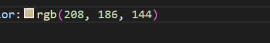

# CSS进阶知识

接下来我们面对的是 **CSS** 的一些更加技巧性的使用属性和方法。
我们接下来将要从`选择器`，`函数`，`布局`和`导航栏`来讲起

## 选择器的扩展
选择器可以分为五类：

- 简单选择器（直接通过id，class，名称选择）
- 组合器选择器（根据他们之间的特殊关系选择）
- 伪类选择起（根据元素的状态选择）
- 伪装元素选择器（选取元素的一部分并设置其样式）
- 属性选择器（根据属性或属性值来选取元素）

当我们面对一些较为大型的网站网页运行维护时，我们所涉及的页面多，控件多，还会有大量的嵌套，这种情况下如果我们在使用 ***class*** 和 ***ID*** 属性的时候所能取的名字愈发减少（词穷，不只是豁出了我们包括英文，拼音和汉字）。
这种情况下，我们通过**组合器选择器**使用可以让我们的编辑更加调理便捷。

-  \*                  
- .class--.class
-  element-element
- 

其中*为选择所有元素，不论元素的类名（class）或者ID为什么，全部选中改变。
### 类名 类名
class和class一起使用有两种形式，第一种是选中同时包含class1和class2的元素，第二种是选中class1中包含class2的元素
```
html

<div class="top">
    <p class="one aaa first">我是老大</p>
    <p class="one aaa second">我是老二</p>
    <p class="one aaa third">我是老三</p>
    <p class="one aaa fouth">我是老四</p>
</div>

css
.top{
    background-color: rgb(256,256,256,0.5);
}
.one.aaa{
    coloe: wight;
}
.one .first{
    color: green;
}
```
在上面的例子中 ***.one.aaa*** 可以选中所有***div***标签中所有的***p***标签，使他们的文字颜色全部变成白色，而第二个 ***.one .first*** 在两个类名中间有个空格，他表达的含义就是选中 ***one*** 元素里所有的 ***first*** 元素，使 ***first*** 元素的颜色变为绿色。
由此看出的是没有空格体现的是 ***和*** 的意义，而带上空格代表的是 ***其中*** 的意义。

### 元素 元素
element和element在 ***除了上述两个方法*** 之外还有 ***另外三种*** 

- element \> element
- element \~ element
- element \+ element

```
html

<div class="top">
    <p class="one aaa first">我是老大</p>
    <p class="one aaa second">我是老二</p>
    <p class="one aaa third">我是老三</p>
    <p class="one aaa fouth">我是老四</p>
</div>

<p class="one aaa first">我是老五</p>
<p class="one aaa second">我是老*</p>
<p class="one aaa third">我是老七</p>    
<p class="one aaa fouth">我是老八</p>

css

div>p 
{
    color: red;
}
div+p
{
    color: green;
}
div~p
{
    color: blue;
}
```

在使用以上选择器的时候，第一个 ***\>*** 的含义是父元素为div的所有p元素，产生的效果就是 ***div元素里嵌套的所有p元素*** 的文字颜色都变为红色；第二个 ***\+*** 的含义是div元素后的第一个p元素，产生的效果就是 ***我是老五*** 变为绿色，这个选择器不包含父子关系；第三个 ***\~*** 的含义是div元素后的所有p元素，产生的效果为 ***老五到老八*** 都变为蓝色；

### 伪类选择起
**什么是伪类？**
伪类用于定义元素的特殊状态。

例如，它可以用于：

设置鼠标`悬停`在元素上时的样式
为`已访问`和`未访问`链接设置不同的样式
设置元素`获得焦点`时的样式

**语法**
伪类的语法：
```
selector:pseudo-class {
  property: value;#与其他css一致继续写
}
```
**锚伪类**
```
/* 未访问的链接 */
a:link {
  color: #FF0000;
}

/* 已访问的链接 */
a:visited {
  color: #00FF00;
}

/* 鼠标悬停链接 */
a:hover {
  color: #FF00FF;
}

/* 已选择的链接 */
a:active {
  color: #0000FF;
}
```
::: 注意：
a:hover 必须在 CSS 定义中的 a:link 和 a:visited 之后，才能生效！（当你定义了link和visited时，若没定义也可以不用管）
a:active 必须在 CSS 定义中的 a:hover 之后才能生效！伪类名称对大小写不敏感。
这里所谓之后，是指前后关系。
:::

更多详细的选择器还有更多包括选择含有那些属性的，选择能产生变化的，等等等等等
可以前往[more](https://www.w3school.com.cn/css/css_selectors.asp)学习更多进阶选择器

## CSS函数
函数，在数学概念里我们知道是将一个集合（称为定义域）中的每个元素与另一个集合（称为值域或陪域）中的唯一元素关联起来的方法，而在计算机领域我们也沿用类似的概念。
函数：f（x，y）
我们通过函数方便快捷的调用已经写好的算法（逻辑）将我们给出的值x，y，计算返回我们需要的结果。
CSS本身定义了一部分函数来方便我们操作一些元素的具体属性值，常用的有：

- attr（）返回元素属性值
- calc（）计算来确定具体属性值
- max（）min（）取冒号两侧较大或较小的值
- rgb（）红绿蓝模型确定颜色
- rgba（）红绿蓝阿尔法模型确定颜色  

### attr（）
```
<style>
a:after {content: " (" attr(href) ")";}
</style>
</head>
<body>

<h1>attr() 函数</h1>

<p>在每个链接后的括号中插入 href 属性的值：</p>

<p><a href="https://bulbul559.cn/">访问网站</a></p>
<p><a href="https://blog.xmgspace.me/">访问网站</a></p>

</body>
```
这个函数的产生结果就是在你写入的内容后面增加一个括号，括号内将href值展示出来。
eg.上码
  访问网站（https://bulbul559.cn/）
  访问网站（https://blog.xmgspace.me/）

### calc（）
```
<style>
#div1 {
  position: absolute;
  left: 50px;
  width: calc(100% - 100px);
  border: 1px solid black;
  background-color: yellow;
  padding: 5px;
  text-align: center;
}
</style>
</head>
<body>

<h1>calc() 函数</h1>

<p>创建一个在整个窗口范围内延伸的 div，div 的每侧和窗口边缘之间的距离为 50px：</p>

<div id="div1">Some text...</div>

</body>
```
运行这行代吗很明显我们会得到结果，一个黄色的方块，他的width随着我们窗口的大小变化，始终和父元素两侧保持50px的距离，通过这个函数我们可以方便的得到一个相对窗口变化稳定的页面。（~~学长强推~~）
另外需要提醒的是除了px这个基础大小单位还有更多单位
其中包括10个相对单位和五个绝对单位

|单位|区别|含义|
|-|-|-|
|px|相对单位|相对于桌面分辨率而不是视窗大小：通常为1个点，一般为1/96英寸|
|em|相对单位|相对于父元素的字体大小，若父元素 font-size 为 16px，那么 1em 就为 16px|
|%|相对单位|相对于父元素，正常情况下是通过属性定义自身或其他元素|
|rem|相对单位|相对于根元素字体大小，若根元素（html）font-size 为 16px，那么 1rem 就为 16px|
|ex|相对单位|相对于小写字母 “x” 的高度|
|vw|相对单位|相对于视窗的宽度：视窗宽度是 100vw|
|vh|相对单位|相对于视窗高度：视窗宽度是 100vh|
|vmax|相对单位|vw 和 vh 中较大的那个|
|vmin|相对单位|vw 和 vh 中较小的那个|
|ch|相对单位|1ch 的大小和字母 o 的宽度相等|
|cm|绝对单位|centimeter，表厘米|
|mm|绝对单位|millimeter，表毫米|
|in|绝对单位|inch，表英寸|
|pt|绝对单位|磅，1/72英寸|
|pc|绝对单位|12点活字，或1/12点|

通过一些相对单位，来相对窗口或者父元素做出改变也可以达到类似效果。

### max（）和 min（）
```
width: max(50%, 300px);
width: min(50%, 300px);
```
很明显，判断50%和300px哪个更大或者更小，max返回大的，min返回小的。

### rgb（）和 rgba（）
当我们调整元素的背景颜色，字体颜色等的时候，只要调整的为颜色就可以使用这个函数，他通过调整三原色的多少比例来确定具体是什么颜色，在vscode中写的时候我们可以看到可以通过元素前面的小方块打开调色板，更加便捷的调整所选颜色。


而其中rgba（）除了三原色还有一个参数，透明度，它可以让你完成一个半透明效果的制作。
```
color : rgb(1,255,135)
color : rgba(1,255,135,0.5)
```
rgb给出的三原色允许你选择0-255的强度来添加三原色的比例多少。
rgba的最后一个参数为1则是完全不透明，小于一为透明度为多少。

调整颜色使用三原色除了RGB模式还有HEX模式，两者相差不大，HEX模式是十六进制，强度的选择最小为00最大为ff eg：红色为#ff0000

::: tip
除了三原色还有一种色相，饱和度，明度来调整的模式HSL
色相（hue）是色轮上从 0 到 360 的度数。0 是红色，120 是绿色，240 是蓝色。
饱和度（saturation）是一个百分比值，0％ 表示灰色阴影，而 100％ 是全色。
亮度（lightness）也是百分比，0％ 是黑色，50％ 是既不明也不暗，100％是白色。
:::

## 布局
在CSS布局中，我们首先要了解的是`position`属性，`position`属性规定应用于元素的定位方法的类型（static、relative、fixed、absolute 或 sticky）。
元素其实是使用 `top`、`bottom`、`left` 和 `right` 属性定位的。但是，除非首先设置了 position 属性，否则这些属性将不起作用。根据不同的 position 值，它们的工作方式也不同。

### position: static
HTML 元素默认情况下的定位方式为 static（静态）。

静态定位的元素不受 top、bottom、left 和 right 属性的影响。

position: static; 的元素不会以任何特殊方式定位;
### position: relative
position: relative; 的元素相对于其正常位置进行定位。

设置相对定位的元素的 top、right、bottom 和 left 属性将导致其偏离其正常位置进行调整。

不会对其余内容进行调整来适应元素留下的任何空间。
```
div.relative {
  position: relative;
  left: 30px;
  border: 3px solid #73AD21;
}
```
当你使用这个属性值，就可以通过四个方位属性来调整他的位置
### position: fixed
position: fixed; 的元素是相对于视口定位的，这意味着即使滚动页面，它也始终位于同一位置。 top、right、bottom 和 left 属性用于定位此元素。

固定定位的元素不会在页面中通常应放置的位置上留出空隙。
### position: absolute

position: absolute; 的元素**相对于最近的定位祖先元素进行定位**（而不是相对于视口定位，如 fixed）。

然而，如果绝对定位的元素没有祖先，它将使用文档主体（body），并随页面滚动一起移动。

注意：“被定位的”元素是其位置除 static 以外的任何元素。
### position: sticky
position: sticky; 的元素根据用户的滚动位置进行定位。

**粘性元素**根据滚动位置在相对（relative）和固定（fixed）之间切换。起先它会被相对定位，直到在视口中遇到给定的偏移位置为止 - 然后将其“**粘贴**”在适当的位置（比如 position:fixed）。

这种效果通常是一些网站***如4399两侧的广告，部分网站的导航栏***所产生的效果。

::: warning
Internet Explorer、Edge 15 以及更早的版本不支持粘性定位。 
:::

### 重叠元素
在对元素进行定位时，它们可以与其他元素重叠。

z-index 属性指定元素的堆栈顺序（哪个元素应放置在其他元素的前面或后面）。

元素可以设置正或负的堆叠顺序。

这个属性可以在一般的第一层上加上第二层或者向下增加层数，使你的元素产生堆叠的效果。
```
img {
  position: absolute;
  left: 0px;
  top: 0px;
  z-index: -1;
}
```
这个例子中我们设置`z-index`属性设置为-1，所以img（一般为图片）就到了下面一层。（当然你要是还有其他图片想要叠到下面可以再增加-2层）
::: warning
值得注意的是，没有经过`z-index`属性修饰的元素通常会显示在顶部，即最上层，而不是默认为0
:::

## 导航栏
首先我们要知道导航栏分为水平导航栏和垂直导航栏
一个简单易用的导航栏对于任何一个网站都是很重要的，通过CSS可以将我们无聊的菜单美化成漂亮的导航栏。
### 导航栏 = 链接列表
导航栏需要标准 HTML 作为基础。

在我们的实例中，将用标准的 HTML 列表构建导航栏。

导航栏基本上就是链接列表，因此使用 <ul> 和 <li> 元素会很有意义：
实例：
```
<ul>
  <li><a href="index.asp">Home</a></li>
  <li><a href="news.asp">News</a></li>
  <li><a href="contact.asp">Contact</a></li>
  <li><a href="about.asp">About</a></li>
</ul>
```
现在，从列表中删除项目符号以及外边距和内边距（填充）：
```
ul {
  list-style-type: none;
  margin: 0;
  padding: 0;
}
```
::: 例子解释：
list-style-type: none; - 删除项目符号。导航条不需要列表项标记。
设置 margin: 0; 和 padding: 0; 删除浏览器的默认设置。
:::

### 垂直导航栏
如需构建垂直导航栏，除了上述的代码外，还可以在列表中设置 \<a> 元素的样式：
实例：
```
li a {
  display: block;
  width: 60px;
}
```
::: 例子解释：
display: block; - 将链接显示为块元素可以使整个链接区域都可以被单击（而不仅仅是文本），我们还可以指定宽度（如果需要，还可以指定内边距、外边距、高度等）。
width: 60px; - 默认情况下，块元素会占用全部可用宽度。我们需要指定 60 像素的宽度。
:::

::: tip
还可以设置 \<ul> 的宽度，并删除 \<a> 的宽度，因为当显示为块元素时，它们将占据可用的全部宽度。这将导致与我们之前的例子相同的结果：
实例：
```
ul {
  list-style-type: none;
  margin: 0;
  padding: 0;
  width: 60px;
} 

li a {
  display: block;
}
```
:::

水平导航栏与垂直导航栏的主要区别也就只有布局的不同，这里不再重复赘述。
