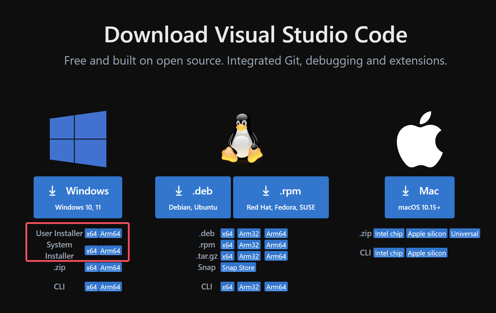
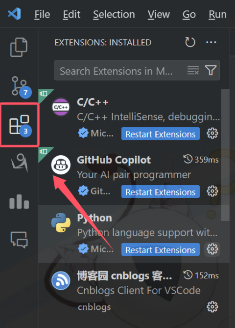

# 入门知识

通过本章教程，你将学会：

1. Visual Studio Code 软件的安装；
1. 一些常用扩展的安装；
1. 了解 Windows 系统中路径的知识。

---

本章节主要介绍一些前备知识，以进行后面的学习。

## 工作环境配置

### Visual Studio Code 下载和安装

一般建议去 Visual Studio Code （以下简称 VSC）的[官方网站](https://code.visualstudio.com/Download)去下载安装，若因为网络环境问题无法访问，可以去 [Microsoft Store](https://apps.microsoft.com/store/detail/XP9KHM4BK9FZ7Q?ocid=pdpshare) 中安装。



:::warning
在安装时请注意当前电脑的操作系统，并注意区分版本：

- 在 Windows 版本中， `User Installer` 是为电脑当前用户安装（安装在用户文件夹下）； `System Installer` 是为所有用户安装，可以自由指定安装位置，一般需要管理员权限；
- 新版 VSC 不再支持 32 位系统，`x64` 位 64 位系统版本，`Arm64` 是针对 ARM 架构处理器构建的版本；Mac 一栏中 `Intel Chip` 是为 Intel 处理器构建的版本，`Apple Silicon` 则是为新版 M 系列处理器构建的版本。

:::

### 扩展安装

VSC 安装扩展比较简单，在最左边找到 `Extensions` 一栏，就可以安装和管理安装的扩展了。



下面推荐几个提高编码 & 生产效率的 VSC 扩展：

- **Live Server**：可以在本地运行一个开发服务器，用来实时查看网页，培训时使用最多的扩展；
- Prettier：自动整理代码的扩展，需要去快捷键设置中为其分配快捷键；
- Auto Rename Tag: 该插件可以自动为你修改闭合标签的名字。当你每次更改元素名字时，还需要修改其闭合标签的名字，该插件便为你做了这个工作；
- Auto Close Tag：该插件可以让你在写完 HTML 元素的标签时，自动为你生成其闭合标签；
- Error Lens：该插件将代码错误显示到编辑器内，无需将鼠标悬浮到代码错误处既可查看到代码的错误。

## 一些概念

### 路径

路径是一个文件在电脑中的位置，你可以通过文件的路径来找到文件。

:::tip

您可以把路径类比成地址，快递员要想准确地找到你家的位置，自然会需要获得你家的地址。
:::

### 相对路径和绝对路径

相对路径是一个文件相对于某一个文件的位置，之所以引入相对路径，就是增加项目部署的可移植性，用户拿到代码时无需再次修改路径（因为下载下来文件的相对位置没有变化）。

绝对路径略。

:::tip 简单的区分相对路径和绝对路径

当你要同学给你送课本到教室时，你一般会直接说你所在的教学楼和教室号，而并没有告诉你的同学类似 “山东省淄博市新村西路 266 号山东理工大学西校区 三号教学楼 201” 这样的地址，因为并没有必要，你们已经约定了你们都在同一个学校（同一级地址）里面。

当你要给家里人寄点儿淄博特产（比如紫米饼，呃，但是笔者不爱吃）时，你需要告诉快递员类似 “山东省淄博市新村西路 266 号山东理工大学西校区西门快递站” 的表述，那是因为，如果你仍然使用 “三教 201” 这样的表述的话，你的包裹寄到分拣站后，快递员肯定会一头雾水：“嘿，哪里的三教？理工大东校区的吗，我记得那儿也有个三教！”。

因此，相对路径和绝对路径适用于不同的情景，开发时应当根据需求合理选择。
:::

用相对路径表示文件时，会用 `.` 来表示当前路径，用 `..` 来省略父目录，且看下例：

```
Project
 |- assets
    |- img
        |- img1.png
        |- ...
    |- less
        |- public.less
        |- ...
 |- public
 |- components
 |- index.html
 |- index.js
 |- vite.config.js
 |- ...

```

在这个文件结构中，倘若我要在 `index.html` 中引入一张图片 `img1.png` ，我应该用 `./assets/img/img1.png` 来表示它的位置；那我要在 `public.less` 中引入这张图片的话，就是 `../img/img1.png` 。

另外在 Web 开发时也会直接用相对于项目根目录的相对路径来表示文件位置，例如也可以用 `/assets/img/img1/png` 来表示这个图片的位置，这种表示方法事实上是最常用的。

## 培训中常用的资源网站

### 文档类

- [w3school](https://www.w3school.com.cn/)
- [菜鸟教程](https://www.runoob.com/)
- [Vue.js 官方文档](https://cn.vuejs.org)
- [Django 官方中文文档](https://docs.djangoproject.com/zh-hans/5.1/)
- [mdn](https://developer.mozilla.org/zh-CN/docs/Web)


